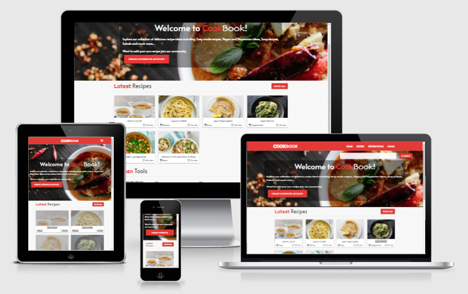

<h1 align="center">CookBook</h1>

[View the live project here.](https://online-cookbook-osvald.herokuapp.com/)

This page is an online recipe book. On this page users can search for recipes and if they have an account they can add their own recipe too. The page provides a range of kitchen tools for the users. Only user with Admin right can edit, delete all recipes and items in the shop. Items in the shop is only for educational purpose (shopping cart and buying the item on page isn't implemetned). Users that doesnt have admin rights can only add, delete and edit recipes and only the recipes they created. Website is accessible on a range of devices with a responsive design. 

<h2 align="center"></h2>

## User Experience (UX)

- ### User stories

    - #### First Time Visitor Goals

        1. As a First Time Visitor, I want to understand the main purpose of the site.
        2. As a First Time Visitor, I want to be able easily navigate through the site.
        3. As a First Time Visitor, I want to search for items and recipes.
        4. As a First Time Visitor, I want to be able get as much information as i can about recipe i picked.
        5. As a First Time Visitor, I want to check their social media channels to see their new and how popular community is.

    -  #### Returning Visitor Goals

        1. As a Returning Visitor, I want to see if there are any new recipes or tools.
        2. As a Returning Visitor, I want to be create my own accounts.
        3. As a Returning Visitor, I want to find contact details, so I could get in contact with organisation if i have any questions.

    -   #### Frequent User Goals

        1. As a Frequent User, I want to easily track my own recipes.
        2. As a Frequent User, I want to add my own recipe.
        3. As a Frequent User, I want to be able to edit or delete my own recipes.
        4. As a Frequent User, I want to search for the item that I would be interested to add to my shopping cart.
        5. As a Frequent User, I want to be able to purchase item.

- ### Design

    -   #### Colour scheme
        - There are three main colors on the page red, white, and black.
        - There are three text colors. White and black is used to achieve the best contrast for users. Red color for text is to achieve more eye-catching page design.
    -   #### Typography
        - For the whole page content, I imported "Alata" font to my style.css file from google fonts. And I used sans-serif as the fallback font if my imported font won't be imported. I imported extra two fonts "Fuzzy Bubbles" and "Righteous" into my style.css file. And I used cursive as the fallback font. These fonts were used only for the page logo.
    -   #### Imagery
        - Images used on page are very important. Starting from background hero image, to give visistor a feeling what this page is about. There is two smaller hero images on recipes list page and kitchent tool page to give these page more appealing look. Rest images on the page represent content, from recipe images to shop item images.

- ### Wireframes

    - Home page wireframe for medium/large screens - [View](static/images/readme-img/home-screen-wireframe-lrg.png)
    - Recipes list page wireframe - [View](static/images/readme-img/recipes-page-wireframe.png)
    - Profile page wireframe - [View](static/images/readme-img/profile-page-wireframe.png)
    - Home page wireframe for small screens - [View](static/images/readme-img/home-screen-wireframe-small.png)

## Features

- ### Existing Features   

    - Responsive design on different screen devices.
    - You can navigate through pages with a navigation bar. [View](static/images/readme-img/no_user_nav_bar.png) 
    - On mobile devices navigation bar is displayed through left side navigation bar and it can be opened by "Burger icon" on screen top right corner. [View](static/images/readme-img/mobile_navbar.png)
    - All website content is on 4 pages when user is not logged. [View](static/images/readme-img/no_user_nav_bar.png) 
        - At home page there is search bar. [View](static/images/readme-img/home_searchbar.png) 
            - If user search for specific recipe or item page will be redirected to search result page vith results if found any. [View](static/images/readme-img/search_result_page.png)
            - Home page has two sections below hero image. Latest added recipes and tools. [View](static/images/readme-img/latest_section.png)
                - If user will pick any of presented latest recipes or items it will be redirected to that specific item view page. [View](static/images/readme-img/item_view_page.png)
                - The home page has a footer that contains contact info, short description about the page and social media links.[View](static/images/readme-img/footer.png)
        - Second and third pages contains all recipes and all kitchen tools offered for the user.
            - Recipes page has category filter option. When category is chosen it will show recipes that belongs to that category. [View](static/images/readme-img/category_filter.png)
        - Both pages have search bars. And search results will depend on what page the user is searching on and results will be focused on items belonging to that specific page. (Recipes will be shown only on the recipes page and kitchen items will be shown only on the kitchen tool page.). [View](static/images/readme-img/search_result.png) 
        - Pages have breadcrumbs navigation. [View](static/images/readme-img/breadcrumbs.png) 
    - When user is logged in there is 2 extra pages on nagiation menu (Profile page and Add recipe page). [View](static/images/readme-img/user_login_navbar.png)
        - Add recipe page lets register user to create his own recipe.[View](static/images/readme-img/add_recipe.png)
        - Profile page contains user information and the list of added recipes [View](static/images/readme-img/profile_recipes.png) or all shop item (if has admin rights). [View](static/images/readme-img/profile_items.png)
        - On profile page user can edit or delete his recipes or shop items (if has admin rights).[View](static/images/readme-img/edit_delete.png)      

- ### Features to Implement

    - Implement rating system that user could rate recipes.
    - Implement comment section.
    - Add videos to specific recipes for more interactive experience.
    - Impplement option for user to print or save  in file the recipe information.
    - Implement news letter option.
    - Implement electronic shop.
    - Implement more profile controling option (Log in with emails/ able to change username, password ect.)


## Technologies Used

- ### Languages Used

    - [HTML5](https://en.wikipedia.org/wiki/HTML5)
    - [CSS3](https://en.wikipedia.org/wiki/Cascading_Style_Sheets)
    - [JavaScript](https://en.wikipedia.org/wiki/JavaScript)
    - [Python](https://www.python.org/)

- ### Frameworks, Libraries & Programs Used

    1. [Google Fonts](https://fonts.google.com/specimen/Varela+Round?query=varela)
        - Used to import "Alata", "Righteous" and "Fuzzy Bubbles" fonts.
    2. [Font Awesome](https://fontawesome.com/)
        - Font Awesome Icons used to give a more appealing look for the page.
    3. [jQuery](https://jquery.com/)
        - jQuery was used for components from Materializecss.
    4. [Git](https://git-scm.com/)
        - Git was used for version control by utilizing the Gitpod terminal to commit to Git and Push to GitHub.
    5. [GitHub:](https://github.com/)
        - GitHub is used to store the projects code after being pushed from Git.
    6. [Adobe-Affinity](https://affinity.serif.com/en-gb/photo/)
        - Used to edit photos and resize images for webpages.
    7. [Figma](https://www.figma.com/)
        - Used to create a wireframe / layout for a web page.
    8. [Pymongo](https://pymongo.readthedocs.io/en/stable/)
        - PyMongo is a Python distribution containing tool for working with MongoDB, and is the recommended way to work with MongoDB from Python.
    9. [MongoDB](https://www.mongodb.com/)
        - Used as database resources to store data for paged in collections.
    10. [Flask](https://flask.palletsprojects.com/en/2.0.x/)
        - API for Python used to build up web-application.
        - Flask depends on the [Jinja](https://jinja.palletsprojects.com/en/3.0.x/) template engine and the [Werkzeug](https://werkzeug.palletsprojects.com/en/2.0.x/) WSGI toolkit.
    11. [Materializecss](https://materializecss.com/)
        - Used to assist with the page responsiveness, for a grid system, to add components and to style them.

## Testing

- The W3C Markup Validator and W3C CSS Validator Services were used to validate landing page of the project to ensure there were no syntax errors in the project.

    - [W3C CSS Validator](https://jigsaw.w3.org/css-validator/#validate_by_input) - [Result](static/images/readme-img/Css-validator.png)

- ### Testing User Stories from User Experience (UX) Section

    - #### First Time Visitor Goals

        1. As a First Time Visitor, I want to understand the main purpose of the site.
            1. Upon entering the site, users are automatically greeted with a navigation bar (with specific to website page names) that contains all the pages. [View](static/images/readme-img/no_user_nav_bar.png)
            2. Underneath there is hero image with a dish image that would give user idea that page is food related. [View](static/images/readme-img/herom_img.png)
            3. Page logo CookBook give an idea for a sured thats is recipe book. [View](static/images/readme-img/logo.png)
            4. Section under hero image contains Latest recipes with image of various dishes. [View](static/images/readme-img/latest_section.png)

        2. As a First Time Visitor, I want to be able easily navigate through the site.
            1. At the top of home page there is a navigation bar, each link name describes content of the page it links to.[View](static/images/readme-img/user_login_navbar.png)
            2. Website has breadcrumbs that user always can go back to the section he was before or choose to go back.[View](static/images/readme-img/breadcrumbs.png)
            3. When user is logged in three more navigation buttons appear. [View](static/images/readme-img/extra_nav.png)
                - Add recipe page - self explanatory - user can add his own recipe.
                - Icon with a human shape symbol that brings the user to his profile page.
                - And the last button is an Icon with open doors - has the meaning for the user to exit his account/log out.

        3. As a First Time Visitor, I want to search for items and recipes.
            1. Home page contains search bar that allows user to search recipes and kitchen tools. [View](static/images/readme-img/home_searchbar.png)
            2. The recipes page has a search bar only for the search queries in the recipe collection.[View](static/images/readme-img/recipe_search.png)
                - Also, the recipe page has category filtering. Users can filter all recipes by recipe category. [View](static/images/readme-img/category_filter.png)
            3. Kitchen Tools page has search bar only for the seacrh queries in the shop collection. [View](static/images/readme-img/kitchen_search.png)

        4. As a First Time Visitor, I want to be able to get as much information as I can about the recipe I picked.
            1. On the home and recipes page. Recipes are listed on card formation with brief information about it. [View](static/images/readme-img/latest_section.png)
            2. When recipe chosen user can view the recipe on view page with much more depth information about it. [View](static/images/readme-img/item_view_page.png)

        5. As a First Time Visitor, I want to check their social media channels to see their new and how popular community is.
            1. Every page on the website has a footer that contains Social medial links. [View](static/images/readme-img/footer.png)

    - #### Returning Visitor Goals

        1. As a Returning Visitor, I want to see if there are any new recipes or tools.
            1. Latest recipes and Items are always shown on home page. [Latest Section](static/images/readme-img/latest_section.png)
            2. Users can always go to a specific page for all listed items to check if there is anything new.

        2. As a Returning Visitor, I want to be create my own accounts.
            1. User if he doesn't have account can create account three ways.
                - On the log in page [View](static/images/readme-img/login.png)
                - Home page hero section [View](static/images/readme-img/home_create_acc.png)
                - On the each page footer there is section to offer user to create his account. [View](static/images/readme-img/footer_join.png)

        3. As a Returning Visitor, I want to find contact details, so I could get in contact with organisation if i have any questions.
            1. All pages has footer where all contant information is provided.[View](static/images/readme-img/footer.png)

    - #### Frequent User Goals

        1. As a Frequent User, I want to easily track my own recipes.
            1. On the profile page, users can find all their added recipes. [View](static/images/readme-img/profile_recipes.png)

        2. As a Frequent User, I want to add my own recipe.
            1. Recipes can be added to the collection by two ways:
                - In the profile page there is a button above all section "All you recipes" to add new recipe. [View](static/images/readme-img/profile_recipes.png)
                - On the navigation bar, there is a section called "Add Recipe" that brings users to Add recipe page. [View](static/images/readme-img/user_login_navbar.png)

        3. As a Frequent User, I want to be able to edit or delete my own recipes.
            1. User can edit or delete recipe only if they are authors of specific recipe. 
                - Admin can edit/delete all recipes includes recipes wasn not created by admin.
            2. Recipe can be edited on profile page when edit button clicked. [View](static/images/readme-img/edit_delete.png)
                - The edit button can be found on the recipe view page either only if the specific recipe was created by that user. [View](static/images/readme-img/item_view_page.png)
            3. To avoid unintentionally deleting the recipe by mistake added a modal form to be called when the delete button is clicked. [View](static/images/readme-img/confirm_delete.png)

        4. As a Frequent User, I want to search for the item that I would be interested to add to my shopping cart.
            1. The latest added items will be displayed on the home page Latest section. [View](static/images/readme-img/latest_section.png)
            2. All items in the shop are displayed on the Kitchen tools page. That can be accessed by the navigation bar section "Kitchen tools". [View](static/images/readme-img/user_login_navbar.png)
            3.  Users can search for items on the home page and Kitchen tools page.

        5. As a Frequent User, I want to be able to purchase item.
            1. Home page latest section and Item view page has a button that adds item to the cart.(Functionality not implemented button used for general view) [View](static/images/readme-img/buy_btn.png) 

- ### Further Testing  
    
    - Website was tested on Google Chrome, Microsoft Edge and Firefox.
    - Used google chrome dev tools Lighthouse to check website accessibility and performance on mobile devices and on desktop.
    - Used Flask debug option and print() functions to check code step by step.
    - Website was tested on different devices: Desktop, Laptop, Samsung Galaxy A21s, Samsung Galaxy S7, Xiaomi POCO F3 and Samsung Galaxy Tab S2.
    - Created an account and then logged in. (Tryed to type in wrong password or username to check if form works) [View](static/images/readme-img/incorrect_login.png)
    - With test account tryed to add, edi and delete recipes.
        |Username|Password |
        |--|--|
        | tomas | tomas123 |
    - Check that only admin can edit and delete all recipes.
    - Created admin account to add, delete and edit items on kitchen_tools collection. [View](static/images/readme-img/admin_prfl.png)
        |Username|Password |
        |--|--|
        | osvaldas | osvaldas1990 |
    - Tested all three search bars. That result would be shown correctly and display message if none found. [View](static/images/readme-img/no_results.png)
    - Tested all links and buttons to make sure they are working.
    - Tested delete button to call modal so it wouldn't be deleted without confimation.[View](static/images/readme-img/confirm_delete.png)
    - Tested logout account and make sure session is dropped. [View](static/images/readme-img/loggedout.png)

- ### Bugs 

    - Search result didin't showed results even there was matched by query. Search form url_for had wrong name.
    - Tryed to use len() "" on "recipes = mongo.db.recipes.find()" function on object. Fix made it list  "recipes = list(mongo.db.recipes.find())".
    - When delete button item was clicked modal form only was able to find first item of collection even if delete button was click on  2,3,4 items... Fix while looping thorugh collection modal ID was added same  id="!modal1" change it to unique ID id="{{recipe}}".
    - Quite a lot of mistypes or wrong used variable with jinja templates on rendered pages.

## Deployment

- ### GitHub Pages

    - The project was deployed to GitHub pages using following steps:
        1. Log in to [GitHub](https://github.com/)
        2. Navigate to your repository. First option you can find all you repositories stored on the top left side of the windows. Click on your user avatar icon top right side of page.
        3. Click on to the repository you want to deploy.
        4. At the top of the window look for a cog icon / settings and click it.
        5. On the left window side look for a section called Pages.
        6. At the GitHub pages under the "Source", click the dropdown menu, choose master branch instead of none and click save.
        7. And you will be able to see highlighted message your site is published.    

- ### Forking the GitHub Repository

    - A GitHub fork is a copy of a repository that sits in your account rather than the account from which you forked the data from. Once you have forked it, you own your forked copy. This means that you can edit the contents of your forked repository without impacting original repository.
        1. Log in to [GitHub](https://github.com/)
        2. Just a little below you user avatar icon there is a button that forks repository.
        3. After you click the button it will fork your repository and you will have a copy.

- ### Making a Local Clone 
    - You can clone your repository to create a local copy on your computer and sync between the two locations.
        1. Log in to [GitHub](https://github.com/) 
        2. Above the list of files, click dropdown menu "Code".
        3. To clone the repository using HTTPS, under "Clone with HTTPS", copy the link and pop up message will show up that link was copied.
        4. Open Git Bash terminal.
        5. Change the current working directory to the location where you want the cloned directory.
        6. Type git clone, and then paste link you copied from "Code" dropdown menu.
        7. Press Enter. Your local clone will be created.
        8. Upon sucesfuly created a your repository clone you will see following information in the terminal.
            ```
            $ git clone https://github.com/YOUR-USERNAME/YOUR-REPOSITORY
            > Cloning into `Spoon-Knife`...
            > remote: Counting objects: 10, done.
            > remote: Compressing objects: 100% (8/8), done.
            > remove: Total 10 (delta 1), reused 10 (delta 1)
            > Unpacking objects: 100% (10/10), done.
            ```

- ### Heroku Deployment

    - Heroku, a container-based cloud Platform as a Service (PaaS). It is a platform capable of hosting backend applications. Even application was created on GitHub, GitHub Pages only allows us to host static websites. We cannot host a Python project on GitHub Pages.
    - First of all we need to create and account on [Heroku](https://id.heroku.com/login).
        1. When we have logged in, we are then presented with the Heroku dashboard.
        2. Select a dropdown button new on the upper right hand side and choose create new app from the dropdown menu.
        3. Then you will be asked to choose name (it has to be unique) and the region (Choose closest location) after both option filled we have to click create App.
            - After app is created you will be brought to current app dashboard.
            1. In order to make the application ready to work in Heroku, we need provide Heroku with a list of applications we used on creating an application.
                - These are stored in the requirements.txt file to create a file a list of all application we need to write command on workspace terminal window
                - pip3 freeze --local > requirements.txt
                - This command should be run each time a new application is added.
            2. Other thing that we need to do, is to create a Procfile. A Procfile is a Heroku-specific type of file that tells Heroku how to run our project.
                - To create the Procfile, we need to input following command on workspace termianl window.
                - echo web: python app.py > Procfile
                - Ensure that any extra blank line in the Procfile is deleted as this could cause issues when running the app.
            3. Push the files to GitHub and we are ready to deploy our application to Heroku.
        4. On the top of current app selection menu choose Settings and under Config Vars, select Reveal Config Vars. This is where the hidden environmental variables need to be stored so Heroku can read them.
        5. Add the environmental variables from env.py file to the Config Vars :
            |KEY|VALUE  |
            |--|--|
            | IP | 0.0.0.0 |
            | PORT | 5000 |
            | SECRET_KEY | < SECRET KEY > |
            | MONGO_URI | < MONGODB CONNECTION > |
            | MONGO_DBNAME | < DB NAME > |
        6. Go back to the Deploy tab and under Deployment method, we have to select GitHub.
            - Enter the yours application Github repository name (in my case "Online-Cookbook") in the Connect to GitHub search box. When the repository appears beneath we can click Connect.
        7. Then a bit under Connect to GitHUb section go to Automatic deploys section and here Enable Automatic Deploys to enable Heroku to automatically update when pushes are made to GitHub.
        8. Under Manual Deploy, select Deploy Branch to start building the app.
            - 'Your app was successfully deployed' will appear once deployment is complete and you may view the live site.

## Credits

- ### Code 

    - [Stackoverflow](https://stackoverflow.com/) - Stackverflow got script to show current year of copyright on footer.
    - [GitHub](https://github.com/Code-Institute-Solutions/TaskManagerAuth/blob/main/04-AddingATask-WritingToTheDatabase/02-materialize-select-validation/static/js/script.js) - Fix for materializecss selection validate bug.
    - [Materializecss](https://materializecss.com/) - Used to assist with the page responsiveness, for a grid system, to add components and to style them.

- ### Media

    - [Unsplash](https://unsplash.com/s/photos/like) - For background image / hero image.
    - [Pexels](https://unsplash.com/s/photos/like) - For the recipes and kitchens tools page title images.
    - [BBCgoodfood](https://www.bbcgoodfood.com/) - Used to get all recipe content information.
    - [Argos](https://www.argos.co.uk/?clickOrigin=header:productdetails:argos+logo) - Used to get all kitchen tools content information.
    
- ### Acknowledgements

    - Code Institute
    - My Mentor for help regarding my queries.
    - Slack community
    - Stackoverflow
    


